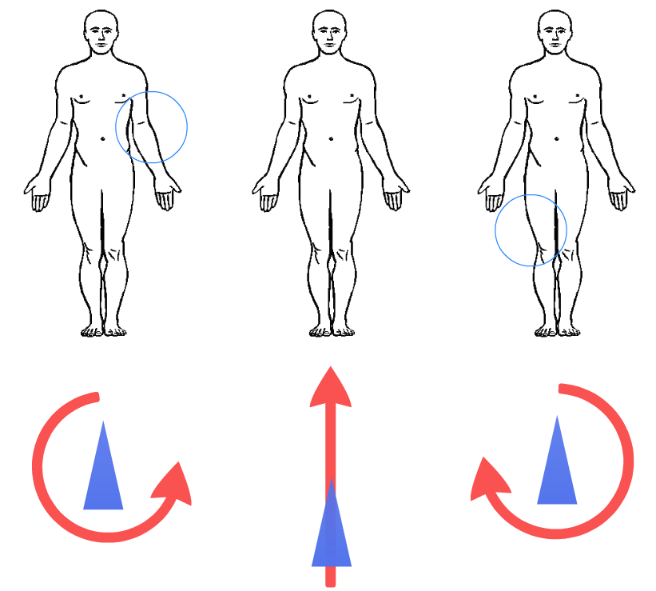

# Mental-Pattern-Recognition
A Framework for classifying mental patterns based on Signal Processing and Machine Learning techniques.
Specifically, we pre-process the electroencephalogram (EEG) signals via a sequence of filterings over both time and space for different EEG channels. Then, we generate the spectral components of the brain using Power Spectrum Density (PSD) and we build a feature vector projecting the frequency information by Principal Component Analysis (PCA). Those feature vectors are used to train a Multi-Layer Perceptron (MLP) Neural Network to classify the mental patterns and control an user interface scheme.

